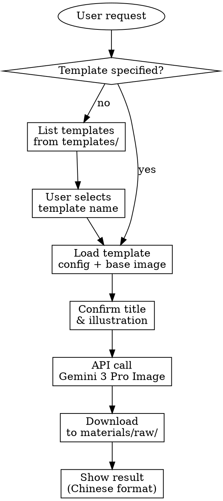
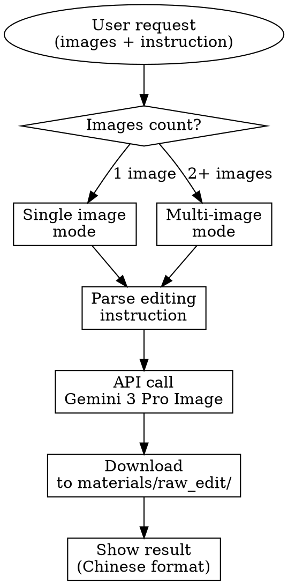

# Nano Banana Pro China - 模板生成与图片编辑

## Overview

使用 Nano Banana Pro (Gemini 3 Pro Image) 通过 Cloudflare Gateway + OpenRouter API 生成和编辑图片。

**核心功能**：
1. **模板生成**: 使用预定义模板生成统一风格的团队图片
2. **图片编辑**: 自由编辑现有图片（修改文本、删除元素、合并图片）

**重要优势**：
- ✅ 通过 Cloudflare Gateway 解决国内访问 OpenRouter 的网络问题
- ✅ 双重认证机制，安全可靠
- ✅ 支持 1K/2K/4K 多分辨率
- ✅ 中文友好的输出格式

## When to Use

### 模板生成 - 使用场景
- 用户请求带"模板"关键词的图片生成
- 团队需要统一的视觉风格
- 需要固定标题和插图位置
- 用户提到"春节海报"、"产品宣传"等模板名称

### 图片编辑 - 使用场景
- 用户请求**修改**现有图片
- 用户提供图片 + 编辑指令
- 用户提到"编辑"、"修改"、"更改"关键词
- 多张图片需要合并
- 图片上的文字需要修改

## Configuration

### Cloudflare Gateway 配置（必需）

国内访问 OpenRouter API 必须使用 Cloudflare Gateway。

**配置文件 `.env`**：
```bash
OPENROUTER_API_KEY=sk-or-v1-your-openrouter-key
OPENROUTER_BASE_URL=https://gateway.ai.cloudflare.com/v1/cdc42e16b43498c2f7acdf3fb6b99fea/openrouter-gateway/openrouter/v1/chat/completions
CF_AIG_TOKEN=cfut_your-cloudflare-gateway-token
```

**双重认证机制**：
```bash
# 请求时需要两个认证 headers
-H 'cf-aig-authorization: Bearer CF_AIG_TOKEN'     # Gateway 认证
-H 'Authorization: Bearer OPENROUTER_API_KEY'      # OpenRouter 认证
```

## Template Workflow



## Image Editing Workflow



## Template Structure

Templates 存储在 `templates/` 目录，每个模板有独立的子目录：

```
templates/
├── spring-festival/
│   ├── template.json       # 模板配置
│   └── base.png           # 基础图片（团队准备的现成图片）
├── product-promotion/
│   ├── template.json
│   └── base.png
└── corporate-culture/
    ├── template.json
    └── base.png
```

**template.json 格式**：
```json
{
  "name": "春节海报",
  "description": "春节主题海报模板",
  "base_image": "base.png",
  "title_position": "顶部居中",
  "illustration_position": "中央区域",
  "font_style": "大标题，红色，喜庆字体",
  "dimensions": {
    "width": 2048,
    "height": 2048
  }
}
```

**关键理解**：Base images 是**团队准备的现成图片**，不是 AI 生成的！

## Agent Workflow Steps

### 模板生成流程

1. **检查用户请求**: 是否提到模板名称？
2. **如果未指定模板**: 运行 `python3 scripts/list_templates.py` → 显示可用模板 → 请用户选择
3. **如果指定模板**: 运行 `python3 scripts/verify_template.py --template NAME` → 检查 base image 是否存在
4. **如果 base image 缺失**: 提示用户"团队必须先准备 base image（现成图片）"
5. **收集参数**: 获取 `--title` 和 `--illustration` 内容
6. **生成**: 运行 `python3 scripts/generate_with_template.py`
7. **监控响应**: 检查状态码，提取图片 URL
8. **下载**: 图片自动保存到 `./materials/raw/`
9. **显示结果**: 使用中文友好的输出格式

### 图片编辑流程

1. **检测编辑请求**: 用户提供图片 + 编辑指令
2. **收集参数**:
   - `--images`: 图片路径（多张图片用逗号分隔）
   - `--instruction`: 编辑指令文本
3. **运行编辑脚本**: `python3 scripts/edit_image.py --images img.png --instruction "修改文字"`
4. **监控响应**: 检查状态码，提取图片 URL
5. **下载**: 图片自动保存到 `./materials/raw_edit/`
6. **显示结果**: 使用中文友好的输出格式

## Script Usage

### 模板生成

**列出可用模板**：
```bash
python3 scripts/list_templates.py
```

**验证模板配置**：
```bash
python3 scripts/verify_template.py --template "春节海报"
```

**使用模板生成图片**：
```bash
python3 scripts/generate_with_template.py \
  --template "春节海报" \
  --title "2026新春快乐" \
  --illustration "一家人团聚吃年夜饭，红灯笼，烟花" \
  --resolution 2K
```

### 图片编辑

**单图编辑**：
```bash
python3 scripts/edit_image.py \
  --images test_img/img.png \
  --instruction "把第一段正文标题更改为：如何寻找诱因？其他保持不变" \
  --resolution 1K
```

**多图合并**：
```bash
python3 scripts/edit_image.py \
  --images car.png,paint.png \
  --instruction "把图2的涂鸦喷绘在图1的汽车上" \
  --resolution 2K
```

## Output Format

**模板生成输出示例**：
```
🎉🎉🎉🎉🎉🎉🎉🎉🎉🎉🎉🎉🎉🎉🎉🎉🎉🎉🎉🎉
图片生成成功！

============================================================
📸 图片信息
============================================================
图片 URL: https://gateway-result.com/xxx.png
⚠️  有效期: 30 天，请及时下载保存
本地路径: ./materials/raw/abc123.png
文件大小: 2.5 MB

============================================================
📋 生成参数
============================================================
使用模板: 春节海报
标题内容: 2026新春快乐
插图描述: 一家人团聚吃年夜饭，红灯笼，烟花
图片尺寸: 2048x2048 (2K)
使用模型: google/gemini-3-pro-image-preview
认证方式: Cloudflare Gateway + OpenRouter

============================================================
💡 下一步操作
============================================================
1. 查看图片：open ./materials/raw/abc123.png
2. 发送到钉钉/飞书？（使用 AI 工具的 message tool）
3. 提醒：图片链接 30 天后失效，请及时保存
============================================================
```

**图片编辑输出示例**：
```
🎉🎉🎉🎉🎉🎉🎉🎉🎉🎉🎉🎉🎉🎉🎉🎉🎉🎉🎉🎉
图片编辑成功！

============================================================
📸 图片信息
============================================================
图片 URL: https://gateway-result.com/xxx.png
⚠️  有效期: 30 天，请及时下载保存
本地路径: ./materials/raw_edit/abc123.png
文件大小: 1.8 MB

============================================================
📋 编辑参数
============================================================
输入图片: img.png (1张图片)
编辑指令: 把第一段正文标题更改为：如何寻找诱因？
图片尺寸: 1024x1024 (1K)
使用模型: google/gemini-3-pro-image-preview
认证方式: Cloudflare Gateway + OpenRouter

============================================================
💡 下一步操作
============================================================
1. 查看图片：open ./materials/raw_edit/abc123.png
2. 发送到钉钉/飞书？（使用 AI 工具的 message tool）
3. 提醒：图片链接 30 天后失效，请及时保存
============================================================
```

## Resolution Options

API 支持三种分辨率（uppercase K required）：

- **1K** (default) - ~1024px resolution
- **2K** - ~2048px resolution
- **4K** - ~4096px resolution

**映射规则**：
- 未提及分辨率 → 1K
- "低分辨率"、"1080"、"1080p"、"1K" → 1K
- "2K"、"2048"、"普通"、"中等分辨率" → 2K
- "高分辨率"、"高清"、"hi-res"、"4K"、"ultra" → 4K

## Common Failures & Solutions

| 错误 | 解决方案 |
|------|---------|
| `HTTP 401 Unauthorized` | 检查 `.env` 文件中的 API keys 是否正确 |
| `HTTP 403 Model not available` | Cloudflare Gateway 可绕过地区限制，确认 Gateway 配置 |
| `Base image NOT FOUND` | 团队需要准备 base.png 文件到模板目录 |
| `Template config not found` | 运行 `list_templates.py` 查看可用模板 |
| `Network timeout` | 确认通过 Cloudflare Gateway 访问，检查网络连接 |

## Important Notes

**关键配置要点**：
1. ✅ 国内必须使用 Cloudflare Gateway
2. ✅ 需要**双重认证** headers（cf-aig-authorization + Authorization）
3. ✅ Base images 是团队准备的现成图片
4. ✅ 模板生成输出到 `materials/raw/`
5. ✅ 图片编辑输出到 `materials/raw_edit/`

**Red Flags - 立即检查**：
- ❌ 只使用单一 Authorization header → 必须双重认证
- ❌ 直接访问 OpenRouter API → 必须通过 Gateway
- ❌ Base image 缺失 → 运行 `verify_template.py` 检查
- ❌ 模板名称错误 → 运行 `list_templates.py` 查看列表
- ❌ 保存到错误目录 → 模板用 `raw/`，编辑用 `raw_edit/`

## Examples

**模板生成示例**：
```bash
# 查看可用模板
python3 scripts/list_templates.py

# 验证模板
python3 scripts/verify_template.py --template "春节海报"

# 生成图片
python3 scripts/generate_with_template.py \
  --template "春节海报" \
  --title "2026新春快乐" \
  --illustration "一家人团聚吃年夜饭" \
  --resolution 4K
```

**图片编辑示例**：
```bash
# 单图编辑
python3 scripts/edit_image.py \
  --images img.png \
  --instruction "修改标题为：新产品发布" \
  --resolution 2K

# 多图合并
python3 scripts/edit_image.py \
  --images bg.png,logo.png \
  --instruction "把logo放在背景图片中央" \
  --resolution 4K
```

## Migration from Wanxiang SDK

如果从 wanxiang-template-generator 迁移：

**保留的内容**：
- ✅ 模板目录结构 (`templates/`)
- ✅ template.json 配置格式
- ✅ 模板选择和验证流程
- ✅ 中文友好的输出格式
- ✅ 输出目录 (`materials/raw/`, `materials/raw_edit/`)

**变更的内容**：
- ❌ 不使用 Alibaba DashScope SDK
- ✅ 改用 Cloudflare Gateway + OpenRouter API
- ✅ 使用 Gemini 3 Pro Image 模型
- ✅ 需要双重认证 headers

**配置迁移**：
```bash
# wanxiang-template-generator (旧)
DASHSCOPE_API_KEY=sk-xxx

# nano-banana-pro-china (新)
OPENROUTER_API_KEY=sk-or-v1-xxx
OPENROUTER_BASE_URL=https://gateway.ai.cloudflare.com/v1/xxx/openrouter/v1/chat/completions
CF_AIG_TOKEN=cfut_xxx
```